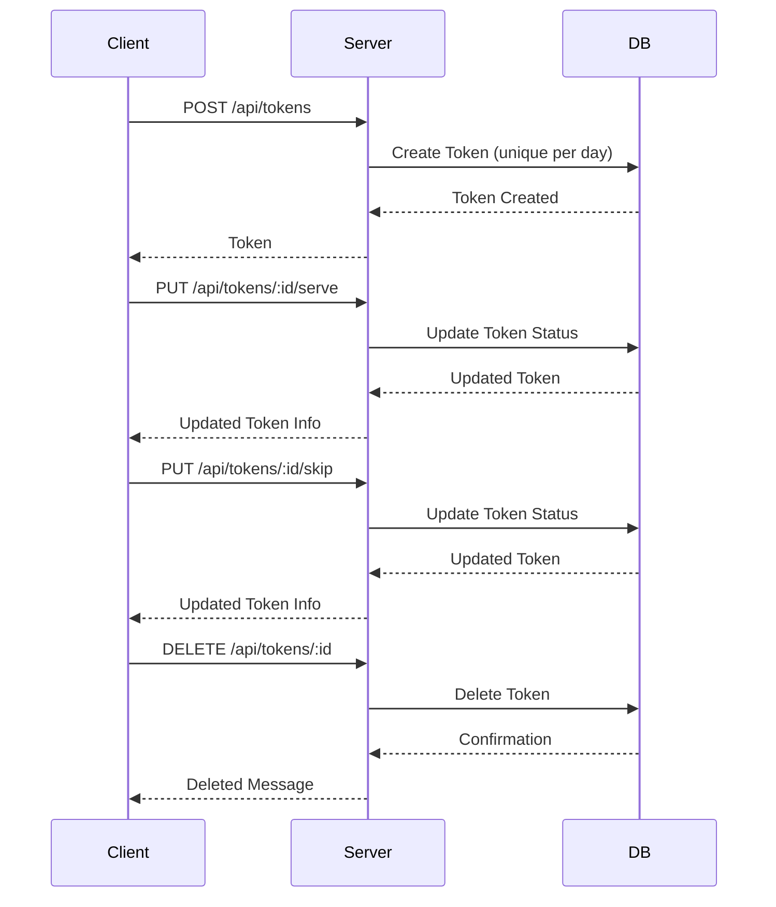

# Token Notification System (Full Stack)

A modern, professional queue management system for clinics, hospitals, or service centers. Built with React, Vite, TailwindCSS, and Socket.IO for real-time updates, plus a Node.js/Express backend with MongoDB, JWT authentication, and integration-ready notification services (SMS, Email, WhatsApp).

---

## Table of Contents

- Features
- Tech Stack
- Architecture
- Folder Structure
- Database Models
- API Endpoints
- App Flow
- Screenshots & Flowcharts
- Setup & Installation
- Environment Variables
- Scripts
- Usage
- Notification Services
- License
- Credits
- References

---

## Features

- **Login Authentication** (JWT-based)
- **Add, Serve, Skip, Delete Tokens**
- **Live Queue Display** (for waiting area screens)
- **Search & Filter Patients**
- **Export Data** (CSV, PDF)
- **Real-time Updates** (Socket.IO)
- **Responsive UI** (TailwindCSS)
- **Unique tokens per day**
- **User registration & login**
- **Extensible notification system (SMS, Email, WhatsApp)**
- **MongoDB for persistence**
- **Comprehensive test coverage (Jest + Supertest)**

---

## Tech Stack

- **Frontend:** React 19, Vite, TailwindCSS, Socket.IO Client, Axios, React Router v7, jsPDF, PapaParse, Lucide Icons
- **Backend:** Node.js, Express, MongoDB (Mongoose), JWT, Socket.IO, Jest, Supertest, Twilio, SendGrid, WhatsApp Web.js

---

## Architecture

```mermaid
flowchart TD
    Client[Client Request] -->|POST /api/tokens| Create[Create Token]
    Create --> DBCheck{Database Check}
    DBCheck -->|Unique (dayKey, tokenNumber)| Saved[Token Saved in DB]
    Saved --> List[GET /api/tokens]
    List --> ReturnList[Return Token List]
    Saved --> Serve[PUT /api/tokens/:id/serve]
    Serve --> UpdateServed[Update Token Status to "served"]
    UpdateServed --> ReturnUpdated[Return Updated Token]
    Saved --> Skip[PUT /api/tokens/:id/skip]
    Skip --> UpdateSkipped[Update Token Status to "skipped"]
    UpdateSkipped --> ReturnSkipped[Return Updated Token]
    Saved --> Delete[DELETE /api/tokens/:id]
    Delete --> ReturnDeleted[Return Deleted Token]
```

---

## Folder Structure

```text
backend/
│
├── controllers/         # Route handlers (auth, token, notify)
├── models/              # Mongoose schemas (Token, User, Counter)
├── routes/              # Express route definitions
├── services/            # Notification integrations (WhatsApp, etc.)
├── middleware/          # Custom Express middleware
├── utils/               # Utility functions (logger, dayKey, sequence)
├── config/              # Database connection
├── tests/               # Jest/Supertest integration tests
├── .env                 # Environment configuration
├── server.js            # Main Express server
├── package.json         # Project metadata & scripts
└── README.md            # Project documentation

frontend/
│
├── src/
│   ├── api/              # API calls (tokenApi.js)
│   ├── components/       # Reusable UI components
│   ├── hooks/            # Custom React hooks (useTokens.js)
│   ├── pages/            # Page-level components (Dashboard, DisplayBoard, LoginPage)
│   ├── App.jsx           # Main app router
│   ├── App.css           # Global styles
│   └── index.css         # Tailwind & fonts
│
├── public/
│   └── vite.svg          # Favicon
│
├── .env                  # Environment variables
├── package.json          # Project metadata & scripts
├── vite.config.js        # Vite configuration
└── index.html            # App entry point
```

---

## Database Models

### Token

- **Fields:**  
  `name`, `contact`, `email`, `tokenNumber`, `dayKey`, `status` (`waiting`, `served`, `skipped`), `notified`, `notifiedAt`, `createdAt`
- **Indexes:**  
  - Unique: `{ dayKey, tokenNumber }`
  - Fast scan: `{ dayKey, status, tokenNumber }`

### User

- **Fields:**  
  `username` (unique), `password` (hashed)
- **Methods:**  
  - `comparePassword(enteredPassword)`

### Counter

- **Fields:**  
  `_id` (dayKey), `seq` (token sequence for the day)

---

## API Endpoints

### Auth

- `POST /api/auth/register`  
  Register a new user

- `POST /api/auth/login`  
  Login and receive JWT

- `POST /api/auth/logout`  
  Logout (clears cookie)

### Tokens

- `POST /api/tokens`  
  Create a new token

- `GET /api/tokens`  
  List tokens (filter by day/status/search)

- `PUT /api/tokens/:id/serve`  
  Mark token as served

- `PUT /api/tokens/:id/skip`  
  Mark token as skipped

- `DELETE /api/tokens/:id`  
  Delete a token

---

## App Flow

```text
LoginPage --> Dashboard
Dashboard --> TokenForm
Dashboard --> TokenList
Dashboard --> NextToken
Dashboard --> ExportButtons
Dashboard --> SearchInput & TokenFilters
Dashboard --> Open Display --> DisplayBoard
DisplayBoard --> DisplayTokenCard
```

---

## Screenshots & Flowcharts

### Dashboard Structure

```text
Dashboard
├── Header
├── TopActions
├── TokenForm
├── NextToken
├── SearchFilters
└── TokenList
```

### Display Board Structure

```text
DisplayBoard
└── DisplayTokenCard
    ├── CurrentToken
    ├── UpcomingTokens
    └── TotalWaiting
```

### Token Flow



---

## Setup & Installation

### Backend

1. **Clone the repository**

   ```sh
   git clone <repo-url>
   cd backend
   ```

2. **Install dependencies**

   ```sh
   npm install
   ```

3. **Configure environment**

   - Copy `.env` and edit as needed (see Environment Variables)
   - For testing, `.env.test` is used automatically

4. **Run the server**

   ```sh
   npm run dev
   # or
   npm start
   ```

### Frontend

1. **Clone the repo:**
   ```sh
   git clone https://github.com/chandan-1427/token-notification.git
   cd token-notification/frontend
   ```

2. **Install dependencies:**
   ```sh
   npm install
   ```

3. **Configure environment:**
   - Edit `.env`:
     ```env
     VITE_BACKEND_URL=http://localhost:5000/api
     VITE_SOCKET_URL=http://localhost:5000
     ```

4. **Run the app:**
   ```sh
   npm run dev
   ```

---

## Environment Variables

### Backend

| Variable              | Description                       | Example                        |
|-----------------------|-----------------------------------|--------------------------------|
| PORT                  | Server port                       | 5000                           |
| NODE_ENV              | Environment                       | development                    |
| MONGO_URI             | MongoDB connection string         | mongodb://localhost:27017/...  |
| JWT_SECRET            | JWT signing secret                | your-secret                    |
| CLIENT_ORIGIN         | Allowed frontend origin           | http://localhost:5173          |
| TIMEZONE              | Timezone for dayKey               | Asia/Kolkata                   |
| TWILIO_*              | Twilio SMS credentials            | ...                            |
| ENABLE_SMS            | Enable SMS notifications          | true/false                     |
| SENDGRID_*            | SendGrid email credentials        | ...                            |
| ENABLE_EMAIL          | Enable email notifications        | true/false                     |
| NOTIFY_BEFORE         | Notify N tokens before their turn | 2                              |
| DEBUG                 | Enable debug logging              | true/false                     |

### Frontend

| Variable           | Description                   |
|--------------------|------------------------------|
| VITE_BACKEND_URL   | Backend API base URL         |
| VITE_SOCKET_URL    | Socket.IO server URL         |

---

## Scripts

### Frontend

| Command           | Description                |
|-------------------|---------------------------|
| `npm run dev`     | Start development server  |
| `npm run build`   | Build for production      |
| `npm run lint`    | Run ESLint                |
| `npm run preview` | Preview production build  |

### Backend

| Command           | Description                |
|-------------------|---------------------------|
| `npm run dev`     | Start development server  |
| `npm start`       | Start server              |
| `npm test`        | Run tests                 |

---

## Usage

- **Login:** Enter credentials to access dashboard.
- **Dashboard:** Add new tokens, view/manage queue, export data.
- **Display Board:** For waiting area screens, shows live queue status.
- **Export:** Download queue data as CSV or PDF.

---

## Testing

- **Run all tests:**

  ```sh
  npm test
  ```

- **Test coverage includes:**
  - Unique token enforcement (`backend/tests/integrity.test.js`)
  - Token API endpoints (`backend/tests/tokensApi.test.js`)

---

## Notification Services

- **SMS:** Twilio integration (see `backend/controllers/notify.js`)
- **Email:** SendGrid integration (see `backend/controllers/notify.js`)
- **WhatsApp:** WhatsApp Web.js integration (see `backend/services/whatsapp.js`)

> **Note:** Notification code is provided but commented out. Configure credentials and enable in `.env` to activate.

---

## License

MIT License. See [LICENSE](LICENSE) for details.  
See `package.json` for backend license details.

---

## Credits

- UI icons: Lucide
- PDF export: jsPDF
- CSV export: PapaParse
- Real-time: Socket.IO

---

## References

- [Express](https://expressjs.com/)
- [Mongoose](https://mongoosejs.com/)
- [Socket.IO](https://socket.io/)
- [Jest](https://jestjs.io/)
- [Supertest](https://github.com/visionmedia/supertest)
- [React](https://react.dev/)
- [Vite](https://vitejs.dev/)
- [TailwindCSS](https://tailwindcss.com/)

---

**Maintainer:** Dakka Chandan

---

For more details, see the source files:

- `backend/server.js`
- `backend/controllers/tokenController.js`
- `backend/models/Token.js`
- `backend/routes/tokenRoutes.js`
- `backend/tests/tokensApi.test.js`
- `backend/utils/dayKey.js`
- `backend/utils/sequence.js`
- `backend/utils/logger.js`

---

*For backend setup, see the `/backend` folder. For frontend setup, see the `/frontend` folder.
