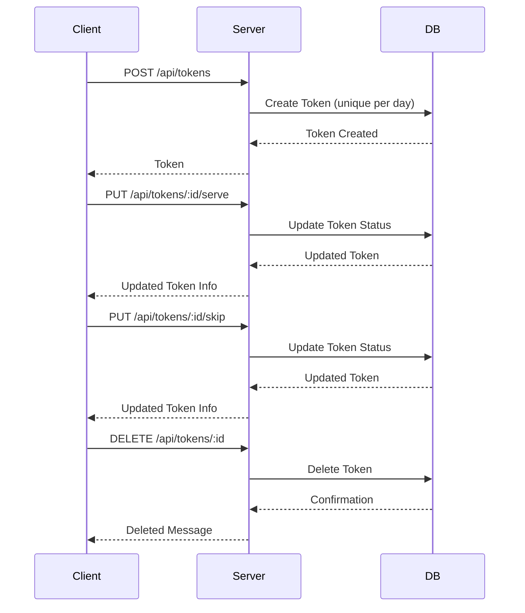

# Token Notification Backend

A Node.js/Express backend for managing a token queue system with real-time notifications, user authentication, and integration-ready notification services (SMS, Email, WhatsApp).

---

## Table of Contents

- Features
- Architecture
- Folder Structure
- Database Models
- API Endpoints
- Token Flow
- Setup & Installation
- Testing
- Environment Variables
- Notification Services
- License

---

## Features

- Token queue management (create, serve, skip, delete)
- Unique tokens per day
- User registration & login (JWT-based)
- Real-time updates via Socket.IO
- Extensible notification system (SMS, Email, WhatsApp)
- MongoDB for persistence
- Comprehensive test coverage (Jest + Supertest)

---

## Architecture

```mermaid
flowchart TD
    Client[Client Request] -->|POST /api/tokens| Create[Create Token]
    Create --> DBCheck{Database Check}
    DBCheck -->|Unique (dayKey, tokenNumber)| Saved[Token Saved in DB]
    Saved --> List[GET /api/tokens]
    List --> ReturnList[Return Token List]
    Saved --> Serve[PUT /api/tokens/:id/serve]
    Serve --> UpdateServed[Update Token Status to "served"]
    UpdateServed --> ReturnUpdated[Return Updated Token]
    Saved --> Skip[PUT /api/tokens/:id/skip]
    Skip --> UpdateSkipped[Update Token Status to "skipped"]
    UpdateSkipped --> ReturnSkipped[Return Updated Token]
    Saved --> Delete[DELETE /api/tokens/:id]
    Delete --> ReturnDeleted[Return Deleted Token]
```

---

## Folder Structure

```
backend/
│
├── controllers/         # Route handlers (auth, token, notify)
├── models/              # Mongoose schemas (Token, User, Counter)
├── routes/              # Express route definitions
├── services/            # Notification integrations (WhatsApp, etc.)
├── middleware/          # Custom Express middleware
├── utils/               # Utility functions (logger, dayKey, sequence)
├── config/              # Database connection
├── tests/               # Jest/Supertest integration tests
├── .env                 # Environment configuration
├── server.js            # Main Express server
├── package.json         # Project metadata & scripts
└── README.md            # Project documentation
```

---

## Database Models

### Token

- **Fields:**  
  `name`, `contact`, `email`, `tokenNumber`, `dayKey`, `status` (`waiting`, `served`, `skipped`), `notified`, `notifiedAt`, `createdAt`
- **Indexes:**  
  - Unique: `{ dayKey, tokenNumber }`
  - Fast scan: `{ dayKey, status, tokenNumber }`

### User

- **Fields:**  
  `username` (unique), `password` (hashed)
- **Methods:**  
  - `comparePassword(enteredPassword)`

### Counter

- **Fields:**  
  `_id` (dayKey), `seq` (token sequence for the day)

---

## API Endpoints

### Auth

- `POST /api/auth/register`  
  Register a new user

- `POST /api/auth/login`  
  Login and receive JWT

- `POST /api/auth/logout`  
  Logout (clears cookie)

### Tokens

- `POST /api/tokens`  
  Create a new token

- `GET /api/tokens`  
  List tokens (filter by day/status/search)

- `PUT /api/tokens/:id/serve`  
  Mark token as served

- `PUT /api/tokens/:id/skip`  
  Mark token as skipped

- `DELETE /api/tokens/:id`  
  Delete a token

---

## Token Flow



---

## Setup & Installation

1. **Clone the repository**

   ```sh
   git clone <repo-url>
   cd backend
   ```

2. **Install dependencies**

   ```sh
   npm install
   ```

3. **Configure environment**

   - Copy `.env` and edit as needed (see Environment Variables)
   - For testing, `.env.test` is used automatically

4. **Run the server**

   ```sh
   npm run dev
   # or
   npm start
   ```

---

## Testing

- **Run all tests:**

  ```sh
  npm test
  ```

- **Test coverage includes:**
  - Unique token enforcement (`tests/integrity.test.js`)
  - Token API endpoints (`tests/tokensApi.test.js`)

---

## Environment Variables

| Variable              | Description                       | Example                        |
|-----------------------|-----------------------------------|--------------------------------|
| PORT                  | Server port                       | 5000                           |
| NODE_ENV              | Environment                       | development                    |
| MONGO_URI             | MongoDB connection string         | mongodb://localhost:27017/...  |
| JWT_SECRET            | JWT signing secret                | your-secret                    |
| CLIENT_ORIGIN         | Allowed frontend origin           | http://localhost:5173          |
| TIMEZONE              | Timezone for dayKey               | Asia/Kolkata                   |
| TWILIO_*              | Twilio SMS credentials            | ...                            |
| ENABLE_SMS            | Enable SMS notifications          | true/false                     |
| SENDGRID_*            | SendGrid email credentials        | ...                            |
| ENABLE_EMAIL          | Enable email notifications        | true/false                     |
| NOTIFY_BEFORE         | Notify N tokens before their turn | 2                              |
| DEBUG                 | Enable debug logging              | true/false                     |

---

## Notification Services

- **SMS:** Twilio integration (see `controllers/notify.js`)
- **Email:** SendGrid integration (see `controllers/notify.js`)
- **WhatsApp:** WhatsApp Web.js integration (see `services/whatsapp.js`)

> **Note:** Notification code is provided but commented out. Configure credentials and enable in `.env` to activate.

---

## License

See `package.json` for license details.

---

## References

- [Express](https://expressjs.com/)
- [Mongoose](https://mongoosejs.com/)
- [Socket.IO](https://socket.io/)
- [Jest](https://jestjs.io/)
- [Supertest](https://github.com/visionmedia/supertest)

---

**Maintainer:** Dakka Chandan

---

For more details, see the source files:

- `server.js`
- `controllers/tokenController.js`
- `models/Token.js`
- `routes/tokenRoutes.js`
- `tests/tokensApi.test.js`
- `utils/dayKey.js`
- `utils/sequence.js`
- `utils/logger.js`

---